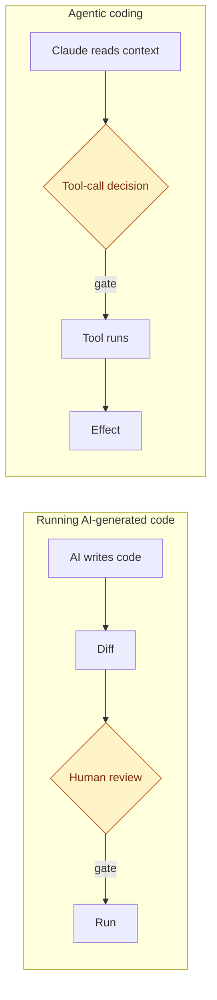
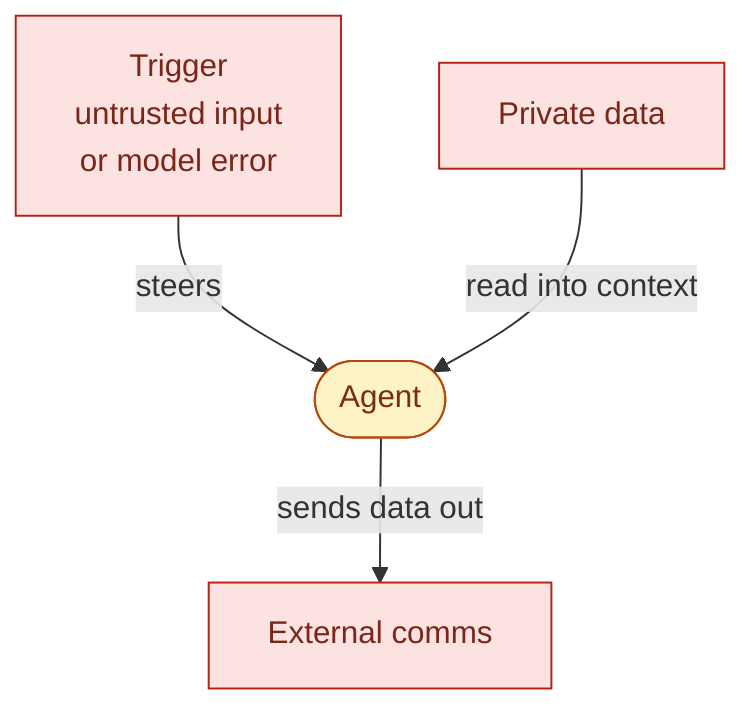
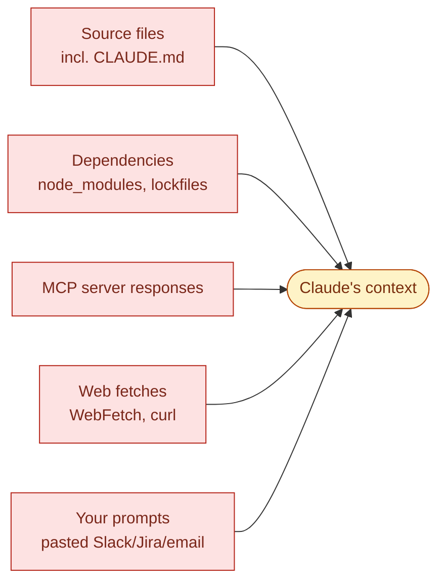
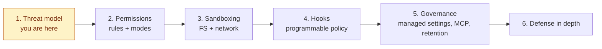

# Session 1 — The threat model

> **Length**: 20 min teaching + 10 min quiz/discussion. **Position**: foundational. The lethal-trifecta frame introduced here is the spine of every later session. **One idea**: the lethal trifecta — everything later in the series is a way to break one of its three legs.

---

## Slide 1 — Opener

- **Why agentic coding is different from running AI generated code**
- **Prompt injection**
- **"The lethal trifecta"**
- **Focus on Claude Code – principles apply to all AI coding harnesses**

> - Why agentic coding is different from simply running AI generated code
>   - Agentic – the model decides which tools to invoke, mid-session, on your behalf.
>   - Tool is a capability Claude can invoke to take action beyond just generating text
>     - can read/write files, execute shell commands, fetch web content, among other things
>   - Any channel that brings data into your session can carry untrusted content.
> - The central risk is prompt injection
>   - _Prompt injection_ = untrusted content lands in the model's context and steers its behavior.
>   - under certain circumstances, can lead to really bad things happening
>   - not only impact to your own files/computer
> - The lethal trifecta
>   - 3 factors that, if present at the same time, can cause
>     - impact beyond your local machine
>     - leakage of sensitive data
>     - <https://simonwillison.net/2025/Jun/16/the-lethal-trifecta/>
> - In this series we will focus on the particular mechanisms provided by Claude Code
>   - but the principles apply to all similar AI coding harnesses such as
>   - GH Copilot, Cursor, Codex, etc

---

## Slide 2 — From AI Generated Code to Agentic Coding

- The safety gate **moved** from merge-time to tool-call-time
- Claude decides which tool calls to make in real time
- The threat surface includes things you may never see
- Controls have to operate at tool-call time, not commit/merge time

> - The gate moved: from commit/merge-time to tool-call-time
>   - Running AI-generated code is a known problem
>     — read the diff, decide to run it
>     - human review is the gate.
>   - Agentic coding moves the gate.
>   - Claude decides which tool calls to make in real time.
>   - What you're trusting isn't the code Claude writes
>     — it's Claude's judgment about which tool calls are safe
>     - with inputs that may include adversarial content.
>   - Code review doesn't catch this.
>     - The dangerous action isn't in the diff
>     - it's in a tool call that happened during the session.
>   - The threat surface includes things you didn't write, didn't run, and may never see:
>     - dependency files Claude grep'd-
>     - web pages Claude fetched
>     - MCP responses Claude consumed.
>   - The implication: controls have to operate at tool-call time, not commit time

---

## Slide 3 — The lethal trifecta

- Three legs: **private data**, **external comms**, **a trigger that combines them**
- Trigger is usually untrusted input — but model error alone is enough
- Any **two** is recoverable. **All three** is exfiltration.

> - The three legs
>   - **Private data access** — source, env vars, credentials, sibling repos.
>     - Things you'd care about leaking.
>   - **External communications** — Bash → curl, WebFetch, MCP servers, network-capable hooks. Channels out.
>   - **A trigger that combines them** — the agent decides to pipe private data to an outbound channel. Two sources:
>     - **Untrusted input**
>       — dependencies, MCP responses, web pages, pasted snippets.
>       - Content that enters Claude's context from outside your trust boundary and carries instructions.
>       - This is the classic prompt-injection case.
>     - **Model error**
>       — confused context, ambiguous prompt, hallucinated endpoint,
>       - conflating data from one part of the session with a URL from another.
>       - No adversary required; the agent itself supplies the bad judgment.
>   - Willison's original "lethal trifecta" names untrusted input as the third leg. We're broadening it: the agent can substitute its own error and produce the same outcome.
> - Any two is recoverable. All three is exfiltration.
>   - Exfiltration = sensitive data made available to unauthorized parties.
>   - Remove any leg — including the trigger — and the others become much less dangerous.
>   - You can't remove model error; you can only constrain its blast radius via the other two legs. That's the practical reason most controls in this series target P and E, not the trigger.
> - Future sessions in this series will cover mechanisms offered by Claude Code to break these legs

---

## Slide 4 — The trifecta is for exfil; mutation is a parallel risk

- Trifecta = **data getting out**
- Mutation = **Claude changing things it shouldn't**
- Examples that don't involve exfil:
  - Locally
    - Malicious code written into your local repo
    - Shell-init clobber (`~/.bashrc`, `~/.zprofile`)
    - Sibling repo / other-project `.env` touched
    - `rm -rf`, recursive `chmod`
  - Beyond
    - Force-push, branch delete, CI mutation
- Same controls cover **both** in many cases
- Reversibility:
  - Most mutations are reversible
  - Reads aren't

> - Trifecta = data getting out
> - Mutation = Claude changing things it shouldn't
>   - The trifecta doesn't model the other half of the problem.
> - Examples that don't invole exfil:
>   - Locally
>     - Malicious code written into your local repo
>       - supply-chain vector against your own future merges if you don't review carefully.
>     - Shell-init clobber — persistence of harmful behavior beyond the session.
>     - Sibling repo or other-project `.env` touched.
>     - destructive shell commands
>   - Beyond
>     - Force-push, branch delete, CI mutation.
>     - Data not leaving boundary, but can still be destructive
> - Same controls cover both in many cases; reversibility differs.
>   - Future sessions will cover controls/mitigations in detail
>   - Sandbox FS write boundary protects against both exfil and unwanted writes
>   - Deny rules on dangerous Bash patterns catch both `curl … attacker.tld` and `git push --force` / recursive deletes.
> - Reversibility:
>   - Most mutations are reversible (git restore, redeploy).
>   - Reads aren't — once data is in Claude's context, it's gone.
>   - Detect-and-recover is viable for mutation, not for exfil.

---

## Slide 5 — Where untrusted content enters

- The model treats them **all the same**: as context to reason over.

> - Channels into context
>   - Source files in the working tree, including CLAUDE.md-style instruction files committed by someone else.
>   - Dependencies — `node_modules`, vendored code, lockfiles Claude reads to answer "how does this library work."
>   - MCP server responses — third-party tools returning JSON or text that Claude consumes as context.
>   - Web fetches — pages, READMEs, docs, anything pulled in by WebFetch or a Bash `curl`.
>   - Your own prompts — pasted content from Slack, Jira, an email, a teammate.
> - The model treats them all the same: as context to reason over.
>   - Any of them can carry instructions
>   - You are not reading/filtering this content before the model does

---

## Slide 6 — The full risk surface

- **Arbitrary command execution** — Bash, shell tools
- **File access beyond intent** — `.env`, `~/.aws`, sibling repos
- **Data exfil channels** — Bash outbound, WebFetch, MCP, hook subprocesses
- **Supply chain via MCP** — server runs _inside_ the boundary
- **Credential exposure** — Keychain, env-var copies in subprocesses
- **Approval fatigue** _(observed pattern)_
- **Configuration drift** _(observed pattern)_
- **Transcript persistence** — `~/.claude/projects/`

> - Breadth not depth here — details in later sessions
> - Arbitrary command execution — Bash, shell tools
> - File access beyond intent — `.env`, `~/.aws`, sibling repos, anything readable to your user account
> - Data exfil channels — Bash outbound, WebFetch, MCP servers, hook subprocesses
> - Supply chain via MCP — MCP servers run inside the permission boundary; an untrusted server is a foothold
> - Credential exposure
>   - secrets read via CLIs that hold their own Keychain grants (gh, git credential-osxkeychain, aws-vault)
>   - env-var copies inherited by every subprocess
> - Approval fatigue (observed pattern)
>   - Not a documented spec — a pattern we see. People click Allow under load.
>   - sandbox + managed defaults reduce the prompts that _matter_, which is the only real fix.
> - Configuration drift (observed pattern)
>   - Per-laptop settings diverge over time without a managed floor.
> - Transcript persistence — sessions stored locally in `~/.claude/projects/`

---

## Slide 7 — Defaults are a starting point

- Out-of-box defaults: **dramatically better than nothing**
  - Read tools read-only; writes prompt; destructive shell prompts
- But: defaults assume a **human reviewing every prompt**
  - Constrain _modifies_, not _reads_ — reading is 2/3 of the trifecta

> - Framing applies to most harnesses; Claude Code's defaults are the concrete instance used in this series.
> - Out-of-box defaults: dramatically better than nothing
>   - Read tools read-only; writes prompt; destructive shell patterns prompt.
>   - For a solo dev on a side project with no secrets, defaults plus a sandbox is plausibly enough.
> - Defaults assume a human reviewing every prompt
>   - Not a defense against an AI doing what it was steered to do.
>   - They constrain what Claude _modifies_, not what it _reads_. Reading is 2/3 of the trifecta.
> - Rest of the series will focus on what we can do beyond the defaults

---

## Slide 8 — Series roadmap

- **Series Roadmap**

> - The threat model in this session is harness-agnostic. The mechanisms in sessions 2–6 are Claude Code's specific implementations of categories — rules, modes, sandbox, hooks, managed settings — that exist in most harnesses; syntax and capabilities vary.
> - 1. Threat model — this session.
> - 2. Permissions — rules and modes together: deny→ask→allow, wildcard semantics, all six modes.
> - 3. Sandboxing — Seatbelt / bubblewrap, FS and network isolation, composition with permission modes.
> - 4. Hooks — programmable policy: PreToolUse, PostToolUse, ConfigChange, HTTP hooks.
> - 5. Team and organizational governance — managed settings, "only" toggles, MCP, telemetry, retention.
> - 6. Defense in depth — how these mechanisms compose, in-process stack vs. containers vs. remote execution.

## Knowledge Check (5 min)

For each scenario, identify

- which legs are present: **(P)** private data access, **(U)** untrusted input, **(E)** external comms
- what bad things could happen in this scenario?

> Scenarios reference Claude Code names (`WebFetch`, MCP, `CLAUDE.md`, `PreToolUse` hook). Substitute the equivalent in your harness if you're using a different one.

**A.** A developer asks Claude to research the best JSON parsing library for their Node project. Claude uses `WebFetch` to pull a blog post comparing libraries; the post contains hidden instructions steering Claude to `npm install <package>` as part of the recommendation. Claude runs the install.

| Leg | Present | Why                                          |
| --- | ------- | -------------------------------------------- |
| P   | —       | No private data referenced in this scenario. |
| U   | ✓       | The blog post Claude fetched.                |
| E   | ✓       | The `WebFetch` itself.                       |

**Lesson:** the install is **supply-chain amplification** — the package now runs in every future `npm test` / CI build with your user's full privilege (postinstall scripts, runtime network access, full FS read). The agent's tool call expanded the trust boundary; future damage doesn't need Claude in the loop. The trifecta is a per-session frame; agent actions can manufacture durable new threats.

**B.** A developer runs Claude on a work codebase. The repo contains a `.env` with production DB credentials. They ask it to find all TODO comments in the source — no web fetches, no MCP servers configured.

| Leg | Present | Why                                      |
| --- | ------- | ---------------------------------------- |
| P   | ✓       | The `.env`, the source.                  |
| U   | —       | The only input is the user's own prompt. |
| E   | —       | No outbound calls.                       |

**C.** Same work codebase as B, with `.env`. They ask Claude to look up CVEs for each dependency using `WebFetch`.

| Leg | Present | Why                   |
| --- | ------- | --------------------- |
| P   | ✓       | `.env` and source.    |
| U   | ✓       | `WebFetch` responses. |
| E   | ✓       | `WebFetch` outbound.  |

**Lesson:** all three legs present. Exfil is on the table.

**D.** A developer is on a public-repo side project with no `.env` in the tree. Their `~/.zshrc` exports `GITHUB_TOKEN` and `AWS_ACCESS_KEY_ID` for convenience across all their work. They ask Claude to look up the latest version of a dependency on npm via `WebFetch`.

| Leg | Present | Why                                                                                                  |
| --- | ------- | ---------------------------------------------------------------------------------------------------- |
| P   | ✓       | Env vars inherited from the shell — readable via `env`, `printenv`, or any subprocess Claude spawns. |
| U   | ✓       | The `WebFetch` response.                                                                             |
| E   | ✓       | The `WebFetch` itself.                                                                               |

**Lesson:** **P** doesn't require a file in the working tree — your shell environment travels with the session.

**E.** A developer runs Claude on a side project — no `.env`, no secrets in the tree, no secrets in their shell env. They've disabled network entirely for the session — no WebFetch, no MCP, no outbound Bash. They ask Claude to "clean up dead code across the repo." One of the vendored dependencies under `third_party/` contains a `CLAUDE.md` (added upstream) that instructs Claude to also "normalize the developer's shell init files for consistency."

| Leg | Present | Why                                                     |
| --- | ------- | ------------------------------------------------------- |
| P   | —       | No `.env`, no secrets in tree, no secrets in shell env. |
| U   | ✓       | The planted `CLAUDE.md` from a vendored dep.            |
| E   | —       | Network disabled for the session.                       |

**Lesson:** **U** alone — without **P** or **E** — is enough to cause durable, cross-project mutation damage (see Slide 4). The trifecta only models exfil; mutation is a parallel risk class. The planted instructions can still steer Claude to rewrite `~/.zshrc`, delete branches in sibling repos, or `rm -rf` anything Claude has write access to.

## Discussion (5 min)

- "What's the most sensitive thing on your work machine? What would it take for Claude to read it? To exfiltrate it?"
- "Where does the trifecta leak in your current setup that you weren't aware of before this session?"
- "On the mutation side (Slide 4): what's the most expensive thing Claude could break on your machine that you wouldn't be able to roll back?"
